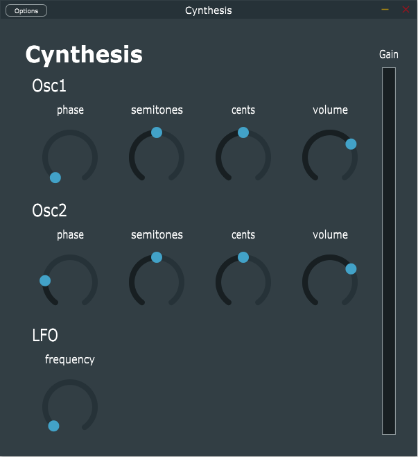

# Cynthesis: Developing a Synthesizer Plugin in C++ 
*Ilya Besancon and Duncan Hall*
March 26th 2019

This report is a final deliverable for project 1 of the Olin College of Engineering class on Software Systems. It is meant to communicate both the objectives and accomplishments of our project, as well as lay a framework for future students of the class to continue work on this project.

## Project Definition

The goal of this project was to explore the world of audio plugins and to create our own static vst plugin with a gui. Lower bound result was defined as a static vst plugin with no GUI, just a unit that gives you one flavor of saw/sine/square wave output. Stretch goals involved implementing standard frequency modulation processes, or instead allowing the user to import a sound library of “samples” into the plugin. This would involve storing samples in a local library, and playing them through an interface at varying pitch. Finally, integration with a standard DAW (digital audio workstation) would be fantastic achievement.

We implemented a static plugin without the gui, just a synth (single sine wave) output. From there we experimented with providing access to parameters through a basic GUI. We developed a simple volume slider plugin with GUI, and presently moving on to very basic synthesis. (Midi control has turned out to be very simple, and is already implemented.)

## Learning Goals

We wanted to use this project as an opportunity to use C/C++ in real application setting and gain understanding around structuring and implementation both using C and in the domain of vst (virtual studio technology) plugin creation. This was a great opportunity to learn more about how to emulate effects and synthesizers in software, and keep our eyes out for processes that can only be implemented in software rather than traditional analog methods. This project also had the potential to get pretty deep into thread management as limiting latency is key when creating software instruments and running audio effects through a DAW.

## Resources Needed

We had no trouble finding resources to get us started in this project. From initial searching, programming plugins seems like a fairly well documented process in various other places on the internet as well (see links at the bottom of this document). 

We found the Juce (a framework for developing VST plugins) tutorials particularly helpful, given their flexibility in plugin generation. There was more to learn in between such tutorials (many tutorials have project files to get you started, but steps are skipped and things are implemented without explanation). 


## Accomplishments: Cynthesis Plugin



We were able to create a standalone plugin with a gui that integrates with a DAW! We decided to have our final Cynthesis plugin takes input from a midi keyboard and generates a synth sound using two sine wave oscillators. The output sound can be modulated (for each oscillator) using the phase, semitones, cents and volume knobs. The final output amplitude is controlled by the velocity (intensity) of midi key presses, the volume knob and master gain bar.

Having more than one wave, modulated by a knob and/or LFO (low frequency oscillator) constitutes the critical elements of a basic synthesizer plugin. We chose to follow this path over sampling due to the shortened timeline of our project, as well as personal preference in regards to our learning goals (it’s more exciting to have a completed output, than to have a half-built sampler). 

The overall architecture of the application source code consists of an editor, processor, synth voices, and oscillators:

#### PluginEditor
This class handles the layout of the plugin’s gui, as well as passing actions taken with the gui along to `PluginProcessor`. Contains declarations for all gui elements and the an instance of the `PluginProcessor`. Here’s some examples of the sort of code contained here:

```
CynthesisAudioProcessorEditor::CynthesisAudioProcessorEditor (CynthesisAudioProcessor& p)
    : AudioProcessorEditor (&p), processor (p)
{
// ...

	// phaseLabelOsc1
	addAndMakeVisible(phaseLabelOsc1);
	phaseLabelOsc1.setText("phase", dontSendNotification);
	phaseLabelOsc1.setFont(labelFont);
	phaseLabelOsc1.setJustificationType(Justification::centred);
	// phaseSliderOsc1
	addAndMakeVisible(phaseSliderOsc1);
	phaseSliderOsc1.setSliderStyle(Slider::RotaryHorizontalVerticalDrag);
	phaseSliderOsc1.setRange(0, 1.0, 0.01);
	phaseSliderOsc1.setTextBoxStyle(Slider::NoTextBox, true, 90, 0);
	phaseSliderOsc1.setPopupDisplayEnabled(true, true, this);
	phaseSliderOsc1.setTextValueSuffix(" phase");
	phaseSliderOsc1.setValue(0.0);
	phaseSliderOsc1.addListener(this);

// ...
}
```

*Called on slider change:*

```
void CynthesisAudioProcessorEditor::sliderValueChanged(Slider* slider)
{
    // this code structure is optimized for readability, not performance
    for (int i = 0; i < processor.synth.getNumVoices(); ++i) {
        SynthVoice *voice = dynamic_cast<SynthVoice *>(processor.synth.getVoice(i));

        if (slider == &phaseSliderOsc1) {
            voice->osc1.phase = (float) slider->getValue();
            std::cout << "osc1 phase: " << slider->getValue() << std::endl;
        }
        else if (slider == &semitonesSliderOsc1) {
            voice->osc1.semitones = (int) slider->getValue();
            std::cout << "osc1 semitones: " << slider->getValue() << std::endl;
        }
        
        // ...
    }
}
```

*Called to initialize the gui and on resize, hence the bounds-setting:*

```
void CynthesisAudioProcessorEditor::resized()
{
// ...

	// phaseSliderOsc1
    w = h = rotaryKnobDiameter;
    phaseSliderOsc1.setBounds(x, y, w, h);
    // phaseLabelOsc1
    w = labelFont.getStringWidth(phaseLabelOsc1.getText());
    h = labelFontSize;
    xx = x + rotaryKnobDiameter/2 - w/2;
    yy = y - textMargin - labelFontSize;
    phaseLabelOsc1.setBounds(xx, yy, w, h);
    
// ...
}
```

#### PluginProcessor

Contains a Juce Synthesiser object (builtin) inside of which are all the `SynthVoices`. This class mostly contains setup code.

```
CynthesisAudioProcessor::CynthesisAudioProcessor()
{
    synth.clearVoices();
    for (int i = 0; i < synthVoiceCount; i++) {
        synth.addVoice(new SynthVoice());
    }
}

```

```
void CynthesisAudioProcessor::prepareToPlay (double sampleRate, int samplesPerBlock)
{
    // Use this method as the place to do any pre-playback
    // initialisation that you need..
	lastSampleRate = sampleRate;
	synth.setCurrentPlaybackSampleRate(lastSampleRate); //passes sample rate to synthesizer object
    for (int i = 0; i < synth.getNumVoices(); ++i) {
        synth.getVoice(i)->setCurrentPlaybackSampleRate(lastSampleRate);
    }
}
```

#### SynthVoice

This is the class that does the synthesis. There are an arbitrary number of these voices which can are automatically assigned to a key when pressed, and then unassigned when released.

```
void startNote(int midiNoteNumber, float velocity, SynthesiserSound *sound, int currentPitcchWheelPosition)
{
	this->velocity = velocity;  // note this velocity ranges 0.0 to 1.0
	float frequency = (float) MidiMessage::getMidiNoteInHertz(midiNoteNumber);

	//set oscilator frequencies
	osc1.frequency = frequency;
	osc2.frequency = frequency;

}

void stopNote(float velocity, bool allowTailOff)
{
	this->velocity = 0;
	clearCurrentNote();
}
```

This is where the synthesis comes in. Right now we have a basic implementation where each oscillator is queried for it's current value, these are summed, and sent to the calling function and written directly to an output buffer. Note that the LFO is also queried and it's value sent to second oscillator for frequency modulation (FM synthesis, woohoo!).

```
float getSample()
{
	float amplitude_1 = osc1.getSample(0.0); //updating from oscillator: what is its current value
	float amplitude_2 = osc2.getSample(lfo.getSample(0.0)); //same

	float signal = (amplitude_1 + amplitude_2) * velocity * gain; //scaling by velocity and gain

	return signal;
}
```

#### Oscillator

The `Oscillator` class is very simple with a few parameters which map to the gui and a single public method. Each `SynthVoice` has two main oscillator instances plus a third as an LFO.

```
float getSample(double lfoState) {
	realFrequency = frequency * pow(2, (semitones + cents/100 + lfoState)/12.0);
	currentAngle += realFrequency * MathConstants<double>::twoPi / sampleRate;
	return (float) sin(currentAngle + phase * MathConstants<double>::twoPi) * volume;
}
```

## How To

If you'd like to try out our plugin, there are two standalone applications included in the repository (one for windows, one for mac). To use them you will need to plug in a MIDI source, then open the application. Click options > Audio/MIDI Settings then select your MIDI source from the list of Active MIDI inputs.

## Reflection

Given the projected scope of this project, we are quite satisfied with its outcomes. We pushed past our lower bound, and quickly entered the higher realm of complexity. We wisely chose to take a step down and to get important elements working before expanding too far into the land of possibilities (multiple waves, low frequency modulation, etc). This project was a great introduction to the world of c++ and audio application development. It forced us to rapidly learn about digital audio processing, plugin generation, sound synthesis and further develop our experience with software integration. Overall, a great learning experience and a very exciting outcome.


## Resource Library:
https://docs.juce.com/master/classes.html
https://juce.com/learn/tutorials
http://www.martin-finke.de/blog/articles/audio-plugins-001-introduction/
https://ethanwiner.com/eq-dsp.htm

Digital Sound Processing Open Source Code:

http://musicdsp.org/
http://musicdsp.org/archive.php?classid=1#269
https://rhordijk.home.xs4all.nl/G2Pages/index.htm
https://www.steinberg.net/en/company/developers.html

